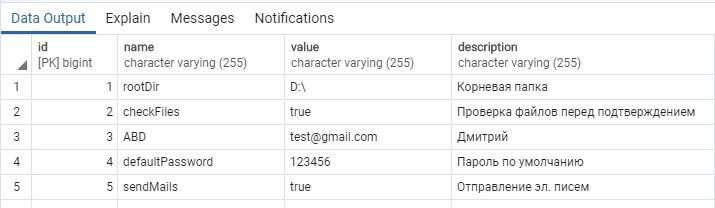

# Система учета накатов (сервер)

## Создание .jar файла
```
mvn package
```
## .jar файл создается в папке "targer". Его запуск:
```
java -jar target/pfscServer.jar
```
## Основные настройки (подключение к БД, порт, автогенерация базы, почтовые настройки) хранятся в:
```
..\pfsc_server\src\main\resources\application.properties
```
## Константы для авторизации:
```
..\pfsc_server\src\main\java\com\pfscServer\security\SecurityConstants.java
```
## Остальные переменные хранятся в базе данных в таблице "configs":

